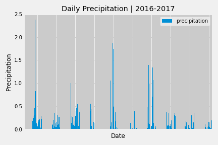
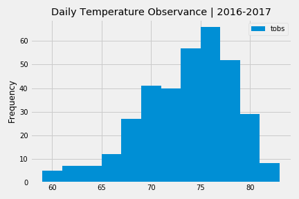

# SQLAlchemy Climate Analysis
Using Python &amp; SQLAlchemy to do basic climate analysis &amp; data exploration

Used SQLAlchemy to do the following:
- 'create_engine' to connect to a sqlite database
- 'automap_base()' to reflect tables into classes
- designed query to retrieve last 12 months of precipitation data

- loaded query results into a Pandas DataFrame &amp; plot
- designed query to calculate the total number of weather stations &amp; the most active stations
- designed query to retrieve last 12 months of temperature observation data

Also created a Flask API based on teh queries from above
- used 'jsonify' to convert data into valid JSON response objects
